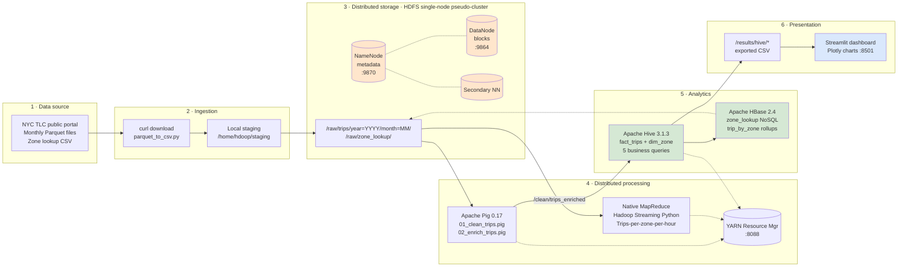

# Big Data Architecture – NYC Yellow Taxi Analytics

**Rendered by:** GitHub / VS Code / any Mermaid-capable Markdown viewer.
This file is the *source*. Export to SVG via the Mermaid CLI or copy-paste into https://mermaid.live for a PNG/SVG to embed in the PDF report.

## High-level flow



## Data-flow annotations

| Arrow | What travels | Volume |
|---|---|---|
| TLC → curl | Parquet files (Jan/Feb/Mar 2026) | ~190 MB |
| curl → HDFS | Headerless CSV (19 cols) | ~1.17 GB across 3 partitions |
| HDFS raw → Pig | Full trip records | 11.1 M rows |
| Pig → HDFS clean | Filtered records | ~8.4 M rows (~700 MB) |
| Pig → HDFS enriched | Cleaned + zone-joined + time-derived | ~1 GB |
| HDFS enriched → Hive | External-table read (no copy) | 8.4 M rows visible as `fact_trips` |
| Native MR → HDFS results | 265 zones × 24 hours aggregations | ~6,360 rows |
| Hive → HDFS results | 5 analytics tables → CSV export | ~few MB total |
| HDFS results → local FS | `hdfs dfs -getmerge` | 5 CSVs → dashboard/data/ |
| Local FS → Streamlit | pandas read_csv on startup | in-memory dataframes |

## Which V does each layer address?

| Layer | Big Data V | How |
|---|---|---|
| Ingestion + HDFS | **Volume** | 9 M rows, ~1 GB CSV, block-replicated storage |
| Monthly partitions | **Velocity** | Simulates monthly batch drops from the TLC portal |
| Parquet ↔ CSV + zone lookup + optional weather | **Variety** | Multiple structured formats joined |
| Pig cleansing filters | **Veracity** | ~5–10% rows dropped for data-quality violations |
| The 5 business queries | **Value** | Direct decisions for driver dispatch, pricing, city planning |

## Component versions locked

| Component | Version |
|---|---|
| Ubuntu | 22.04.5 |
| Java (OpenJDK) | 1.8.0_352 |
| Hadoop | 3.2.1 |
| Pig | 0.17.0 |
| Hive | 3.1.3 |
| HBase | 2.4.18 |
| Python | 3.10 (Ubuntu default) |
| Streamlit | 1.30+ |
| pyarrow | 21.0+ |

## Alternate rendering (for the PDF report)

If the reviewer's PDF viewer doesn't render Mermaid, export to SVG:

```bash
npm install -g @mermaid-js/mermaid-cli
mmdc -i architecture.md -o architecture.svg
```

Or paste the Mermaid block into https://mermaid.live and click **Actions → PNG/SVG**.
